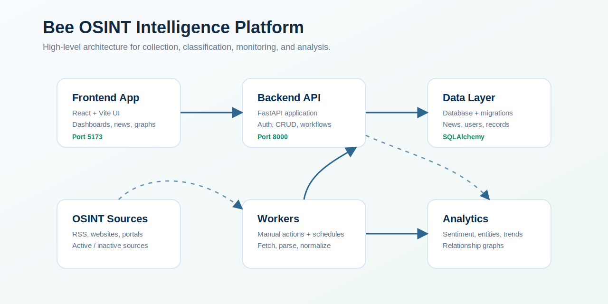
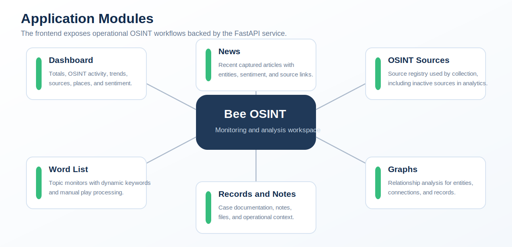
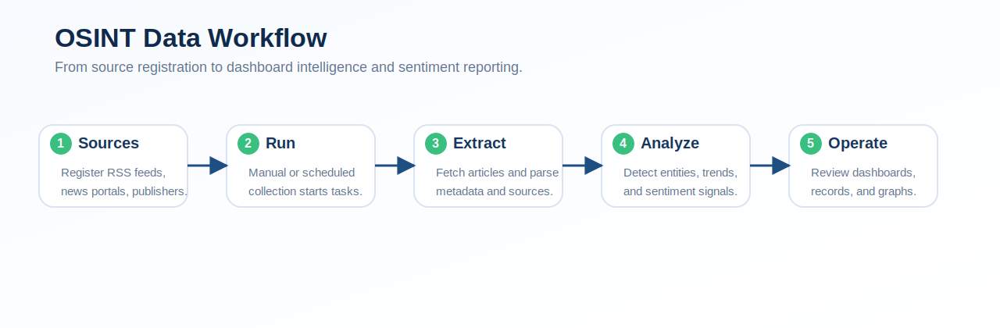

# Bee OSINT Intelligence Platform

Bee is a full-stack OSINT monitoring system for collecting news from configured sources, organizing findings, tracking topic monitors, reviewing sentiment, and analyzing entities through dashboards and relationship graphs.

The repository contains two applications:

- `backend`: FastAPI service with authentication, data models, source collection, analytics, and API endpoints.
- `frontend`: React and Vite interface for dashboards, news review, OSINT source management, word lists, records, notes, and graphs.

## System Images







## Repository Layout

```text
bee/
  backend/        FastAPI API, database models, services, migrations, tests
  frontend/       React application, views, components, API client, assets
  docs/images/    Project diagrams used by this README
  README.md       Main project documentation
```

## Main Capabilities

- User authentication and protected API access.
- OSINT source registry for online media and web text sources.
- News collection, normalization, storage, and review.
- Sentiment analysis across registered sources.
- Word List topic monitors with dynamic keywords and manual processing.
- Dashboard metrics for sources, places, terms, activity, and sentiment.
- Notes, records, and file-oriented investigation support.
- Relationship graph workspace for entities and cases.

## Technology Stack

| Layer | Technology |
| --- | --- |
| Frontend | React, Vite, JavaScript, CSS |
| Backend | FastAPI, Python, SQLAlchemy, Alembic |
| Database | SQLite by default, configurable through environment variables |
| API Docs | OpenAPI generated by FastAPI |
| Tooling | npm, uv, pytest, ruff |

## Quick Start

### 1. Start the backend

```bash
cd backend
cp .env.example .env
uv sync
uv run alembic upgrade head
uv run python default_user.py
uv run uvicorn app.main:app --host 127.0.0.1 --port 8000 --reload
```

Backend API documentation:

```text
http://127.0.0.1:8000/docs
```

Default development user:

```text
Username: admin
Email: admin@example.com
Password: admin123
```

### 2. Start the frontend

```bash
cd frontend
npm install
npm start
```

Frontend application:

```text
http://localhost:5173
```

## Environment

The backend reads configuration from `.env`. The exact variables depend on the backend settings module, but a typical local setup includes:

```env
DATABASE_URL=sqlite:///./sisar.db
SECRET_KEY=change-this-secret
ACCESS_TOKEN_EXPIRE_MINUTES=1440
```

The frontend should point to the backend API base URL used by the local FastAPI server. Check the frontend README and API client configuration for the current variable names.

## Core Workflow

1. Add or update OSINT sources in the system.
2. Run collection tasks from the UI or scheduler.
3. Store normalized news items in the backend database.
4. Review recent news, source activity, and extracted metadata.
5. Use Word List monitors to track topics and keyword groups.
6. Analyze sentiment, trends, places, and source activity in the dashboard.
7. Create records, notes, and graphs for deeper investigations.

## Development Checks

Backend:

```bash
cd backend
uv run ruff check app tests
uv run pytest
uv run python -m compileall app
```

Frontend:

```bash
cd frontend
npm run lint
npm run build
```

## Documentation

- [Backend README](backend/README.md)
- [Frontend README](frontend/README.md)
- [Contribution Guide](CONTRIBUTING.md)

## Deployment Notes

- Use a production database instead of the default local SQLite database.
- Set a strong secret key and environment-specific credentials.
- Run database migrations before starting the API.
- Serve the frontend build with a production web server or static hosting layer.
- Restrict API access, configure CORS intentionally, and protect admin endpoints.
- Monitor source collection tasks so failed or inactive feeds are visible.

## License

Bee is distributed under the Apache License 2.0. See [LICENSE](LICENSE) for the authoritative license terms.
